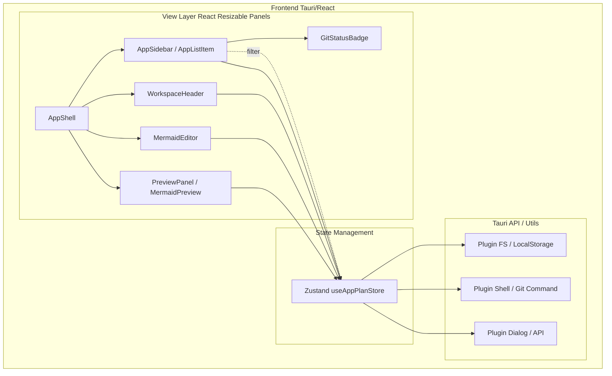

# Application Architecture

```mermaid
graph TD
  subgraph frontend [Frontend Tauri/React]
    subgraph components [View Layer React Resizable Panels]
      appshell[AppShell]
      sidebar[AppSidebar / AppListItem]
      workspace[WorkspaceHeader]
      editor[MermaidEditor]
      preview[PreviewPanel / MermaidPreview]
      badge[GitStatusBadge]
    end
    
    subgraph state [State Management]
      zustand[Zustand useAppPlanStore]
    end
    
    subgraph external_api [Tauri API / Utils]
      taurifs[Plugin FS / LocalStorage]
      taurishell[Plugin Shell / Git Command]
      tauricapture[Plugin Dialog / API]
    end
    
    appshell --> sidebar
    appshell --> workspace
    appshell --> editor
    appshell --> preview
    
    sidebar --> badge
    sidebar -. filter .-> zustand
    
    sidebar --> zustand
    workspace --> zustand
    editor --> zustand
    preview --> zustand
    
    zustand --> taurifs
    zustand --> taurishell
    zustand --> tauricapture
  end
```
