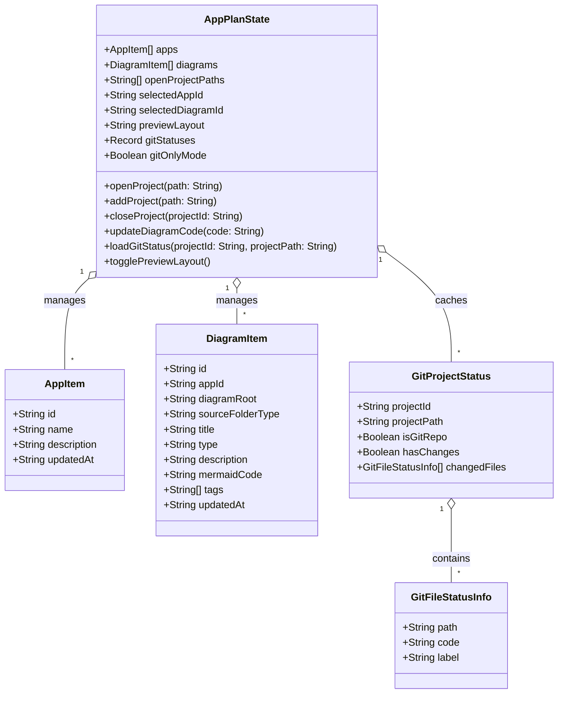

# Class Diagram

```mermaid
classDiagram
  class AppItem {
    +String id
    +String name
    +String description
    +String updatedAt
  }

  class DiagramItem {
    +String id
    +String appId
    +String diagramRoot
    +String sourceFolderType
    +String title
    +String type
    +String description
    +String mermaidCode
    +String[] tags
    +String updatedAt
  }

  class GitProjectStatus {
    +String projectId
    +String projectPath
    +Boolean isGitRepo
    +Boolean hasChanges
    +GitFileStatusInfo[] changedFiles
  }

  class GitFileStatusInfo {
    +String path
    +String code
    +String label
  }

  class AppPlanState {
    +AppItem[] apps
    +DiagramItem[] diagrams
    +String[] openProjectPaths
    +String selectedAppId
    +String selectedDiagramId
    +String previewLayout
    +Record<string, GitProjectStatus> gitStatuses
    +Boolean gitOnlyMode
    +openProject(path: String)
    +addProject(path: String)
    +closeProject(projectId: String)
    +updateDiagramCode(code: String)
    +loadGitStatus(projectId: String, projectPath: String)
    +togglePreviewLayout()
  }

  AppPlanState "1" o-- "*" AppItem : manages
  AppPlanState "1" o-- "*" DiagramItem : manages
  AppPlanState "1" o-- "*" GitProjectStatus : caches
  GitProjectStatus "1" o-- "*" GitFileStatusInfo : contains
```
