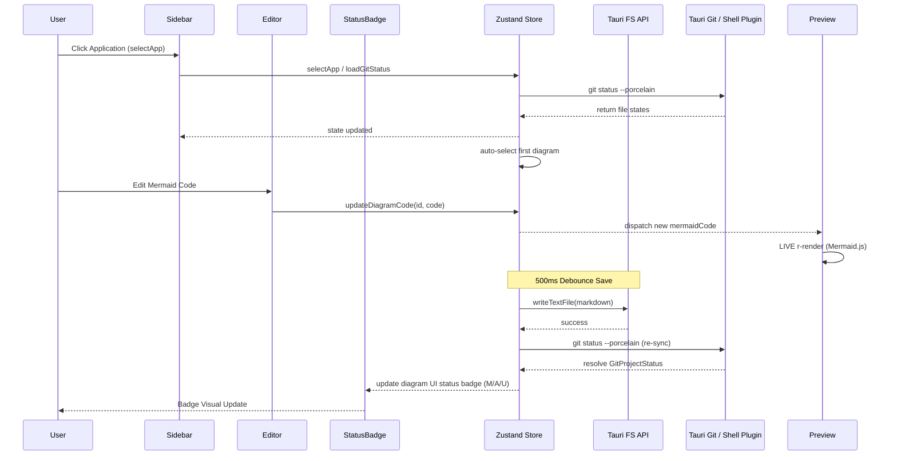

# Flow Diagram

```mermaid
sequenceDiagram
  participant User
  participant Sidebar
  participant Editor
  participant StatusBadge
  participant Store as Zustand Store
  participant FS as Tauri FS API
  participant Shell as Tauri Git / Shell Plugin
  participant Preview

  User->>Sidebar: Click Application (selectApp)
  Sidebar->>Store: selectApp / loadGitStatus
  Store->>Shell: git status --porcelain
  Shell-->>Store: return file states
  Store-->>Sidebar: state updated
  Store->>Store: auto-select first diagram
  
  User->>Editor: Edit Mermaid Code
  Editor->>Store: updateDiagramCode(id, code)
  Store-->>Preview: dispatch new mermaidCode
  Preview->>Preview: LIVE r-render (Mermaid.js)

  Note over Store,FS: 500ms Debounce Save
  Store->>FS: writeTextFile(markdown)
  FS-->>Store: success
  Store->>Shell: git status --porcelain (re-sync)
  Shell-->>Store: resolve GitProjectStatus
  Store-->>StatusBadge: update diagram UI status badge (M/A/U)
  StatusBadge-->>User: Badge Visual Update
```
